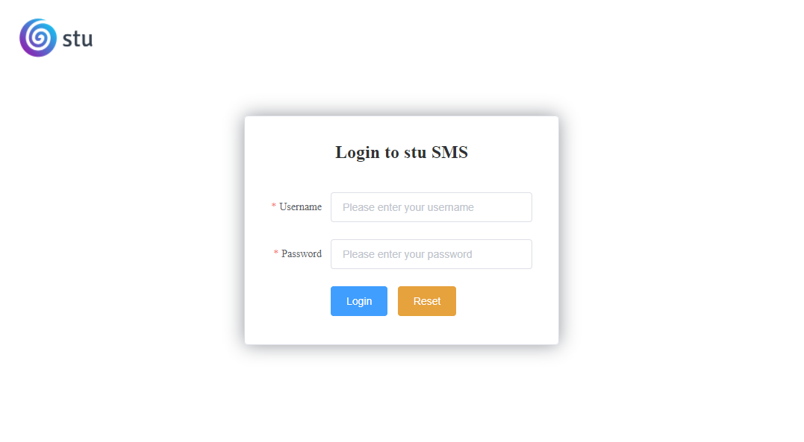
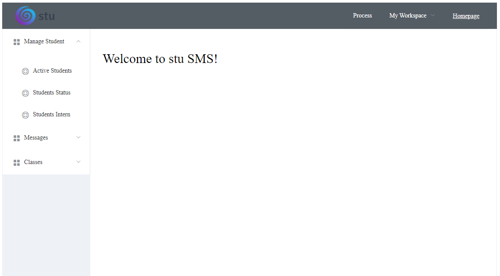
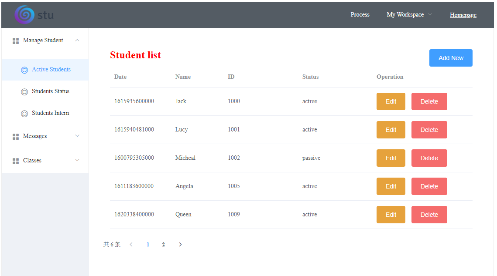
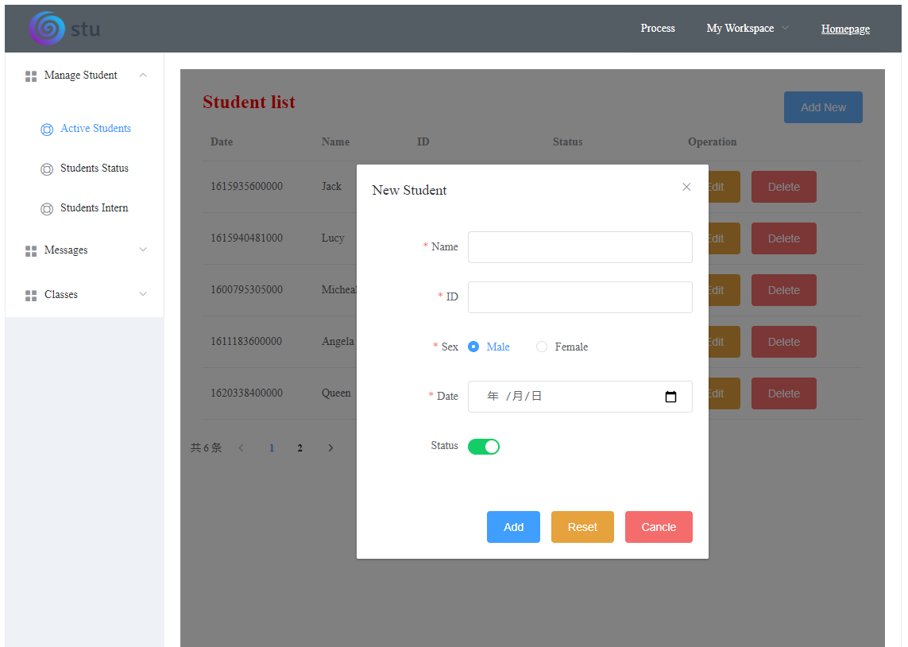
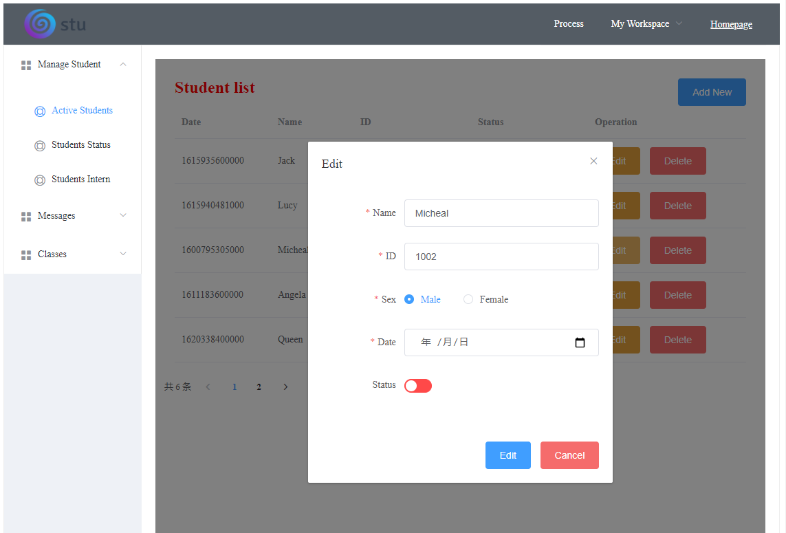

# Stu-SMS
Stu Student Management System, which is a template of management system.

🎯**Aim:** contribute three version step by step for this management system

📝**TODO List:**

- ✅1st version: **Vintage Memory**
- 2ed version: **New Wave**
- 3rd version: 

### Vintage Memory

**Tech stack and version:**

- Front-End: HTML + CSS + Vue.js v2.6.10 + Element
- Back-End: Servlet + Tomcat 8.5.63 + [Jackson 2.2.3](https://github.com/FasterXML/jackson) + [MyBatis 3.5.3](https://mybatis.org/) + PageHelper 5.1.10 + log4j 1.2.17
- Dev Tool: IDEA IntelliJ
- JDK 13

**Introduction:** MVC architecture, classic kit. Use modern JavaScript framework Vue.js and MyBatis, so not totally old tech stacks. Aim to experience with servlet.

**Previews:**

login (Username: admin, Password: admin)

homepage

student list

add new student

edit

**Contributing:**

- the display of date is wrong
- more feature...

### New Wave

Totally applying in SSM architecture.

No changes to front-end, use Maven to management, so more detailed version info, pls see the pom file.

One thing have to say it that using Mybatis-plus to simplify the Mybatis process.

**Contributing:**

- ✅list data
- ✅add new student
- ✅edit student info
- ✅delete a student
- filter
- ...

